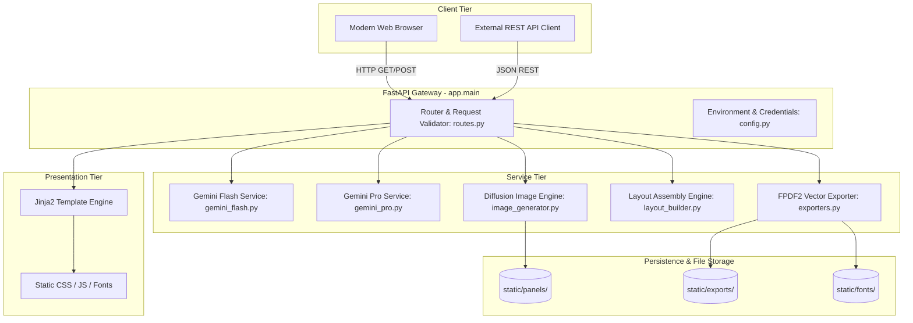
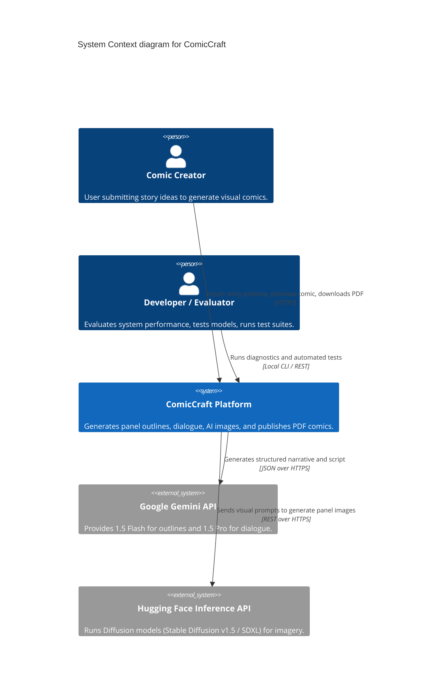
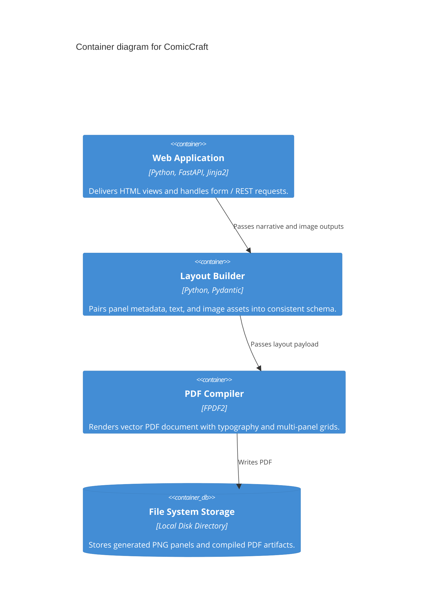
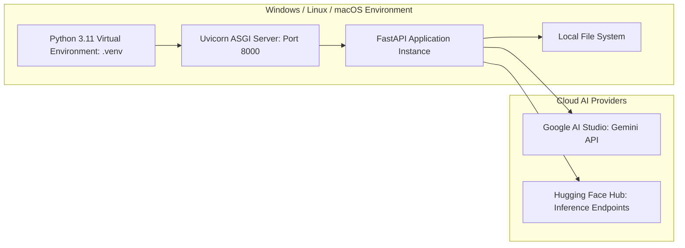

# Phase 3: Project Design
## Document 01: System Architecture & C4 Model

---

### 1. High-Level Architectural Vision

ComicCraft adopts a modular, service-oriented monolithic architecture built atop **FastAPI**. It decouples the narrative generation intelligence (Google Gemini LLMs), visual diffusion engines (Hugging Face / Fallback Canvas), layout positioning logic, and the PDF publication compiler into distinct, testable layers.

---

### 2. C4 Model Specifications

#### 2.1 Level 1: System Context Diagram

#### 2.2 Level 2: Container Diagram

#### 2.3 Level 3: Component Diagram (Backend Modules)

| Component Name | Module File | Core Responsibility | Key Inbound / Outbound Types |
| :--- | :--- | :--- | :--- |
| `FastAPI App` | `app/main.py` | App lifecycle, static mount, router registration | HTTP Request / Response |
| `Route Handlers` | `app/routes.py` | `/`, `/generate`, `/generate-comic/json`, `/test-image` | Form Data, JSON payloads |
| `Gemini Flash Client`| `app/gemini_flash.py`| Prompts Gemini Flash to construct 5-panel narrative arc | `ComicStoryRequest` $\to$ `List[PanelOutline]` |
| `Gemini Pro Client` | `app/gemini_pro.py` | Expands outline into character dialogue & captions | `List[PanelOutline]` $\to$ `List[EnrichedPanel]` |
| `Image Generator` | `app/image_generator.py`| Queries HF API or procedural fallback for PNGs | `EnrichedPanel` $\to$ PNG file path |
| `Layout Builder` | `app/layout_builder.py`| Merges story text, dialogue, onomatopoeia & image paths | Enriched panels $\to$ `ComicLayout` |
| `PDF Exporter` | `app/exporters.py` | Arranges comic panels onto A4 PDF grid via FPDF2 | `ComicLayout` $\to$ PDF file path |
| `Settings & Config` | `app/config.py` | Reads `.env`, validates keys, sets defaults | Environment variables |

---

### 3. Deployment Architecture

