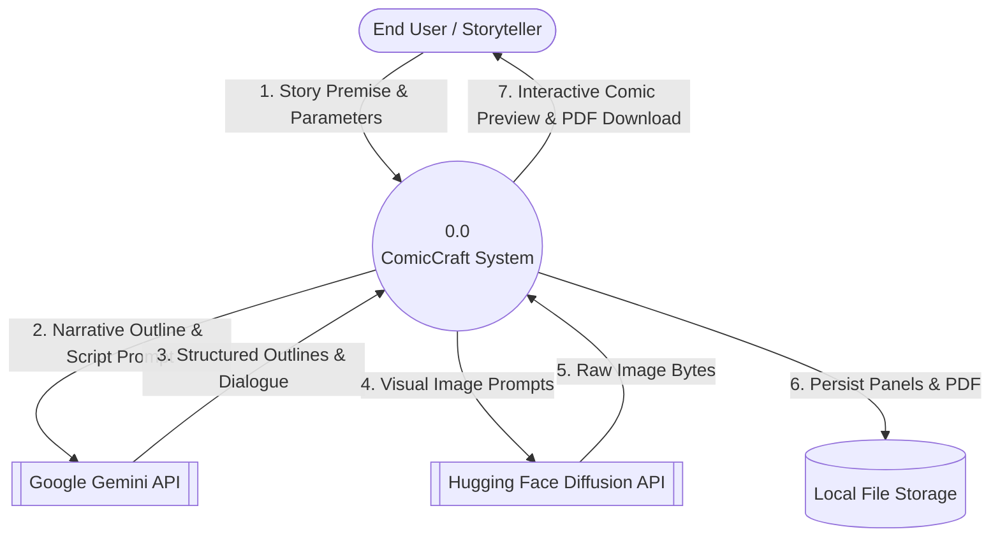
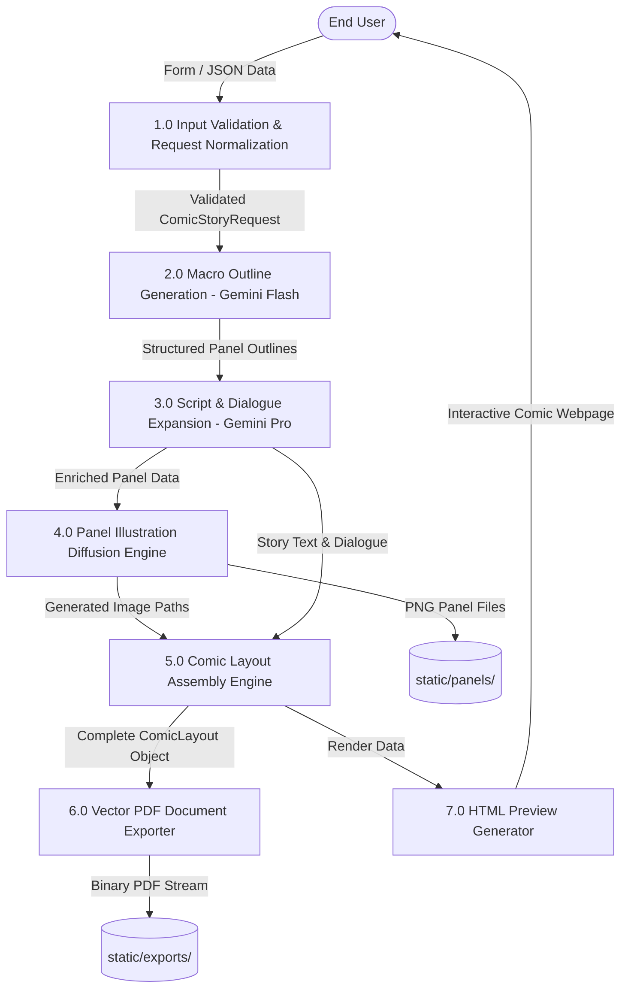
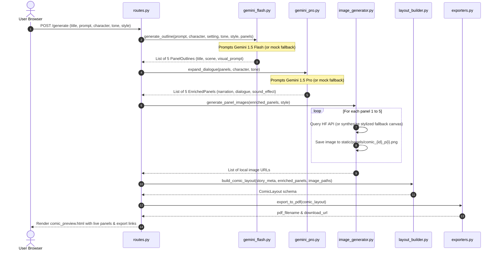

# Phase 3: Project Design
## Document 02: Data Flow Diagrams (DFD Levels 0, 1, 2)

---

### 1. DFD Level 0: Context Level Diagram

---

### 2. DFD Level 1: System Decomposition

---

### 3. DFD Level 2: Detailed Generation Subsystem (Processes 2.0 to 5.0)

