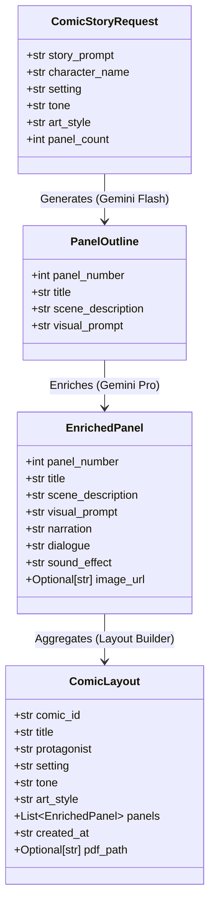

# Phase 3: Project Design
## Document 03: Data Contracts & Pydantic Schema Specifications

---

### 1. Pydantic Core Data Schemas

ComicCraft strictly validates all internal states and external payloads using Pydantic v2 schemas defined in `app/models.py`.



---

### 2. REST API Request / Response Contracts

#### 2.1 Endpoint: `POST /generate-comic/json`
- **Request Headers**: `Content-Type: application/json`
- **Request Body JSON Example**:
```json
{
  "story_prompt": "A time traveler accidentally drops a modern smartphone in ancient Rome.",
  "character_name": "Dr. Clara Oswald",
  "setting": "Colosseum and Roman Forum, 80 AD",
  "tone": "Humorous Sci-Fi",
  "art_style": "Classic Comic Book",
  "panel_count": 5
}
```

- **Response Body JSON Example (HTTP 200 OK)**:
```json
{
  "status": "success",
  "comic_id": "c7f1a92e",
  "title": "A Phone in the Forum",
  "character_name": "Dr. Clara Oswald",
  "setting": "Colosseum and Roman Forum, 80 AD",
  "tone": "Humorous Sci-Fi",
  "art_style": "Classic Comic Book",
  "panels": [
    {
      "panel_number": 1,
      "title": "A Slip Through the Centuries",
      "scene_description": "Wide shot of Dr. Clara tumbling through a shimmering golden portal onto dusty Roman paving stones.",
      "visual_prompt": "Classic comic book style, wide shot, female time traveler in steampunk leather coat stumbling out of golden vortex into ancient Rome, halftone dots, bold ink lines",
      "narration": "Rome, 80 AD. The glory of the empire... and the site of temporal disaster.",
      "dialogue": "Clara: 'Hold on tight, Clara, the landing is always the roughest—'",
      "sound_effect": "WHOOSH!",
      "image_url": "/static/panels/comic_c7f1a92e_panel_1.png"
    }
  ],
  "pdf_path": "/static/exports/comic_c7f1a92e.pdf",
  "download_url": "/download-pdf/comic_c7f1a92e.pdf"
}
```

---

#### 2.2 Endpoint: `POST /test-image`
- **Request Body (Form or JSON)**:
```json
{
  "prompt": "Cyberpunk detective examining glowing holographic clue in neon alley",
  "style": "Dark Cyberpunk"
}
```
- **Response**:
```json
{
  "status": "success",
  "image_url": "/static/panels/test_preview.png",
  "prompt_used": "Dark Cyberpunk style, neon lights, gritty shadows, high contrast comic book art: Cyberpunk detective examining glowing holographic clue in neon alley"
}
```

