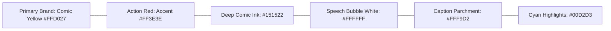

# Phase 3: Project Design
## Document 04: UI/UX Design Specifications & Comic Design System

---

### 1. Visual Design Philosophy: "Authentic Golden Age Meets Modern Web"

ComicCraft utilizes a distinctive graphic design language derived from classical comic book printing:
- **Halftone Dot Accents**: Subtle dot matrices mimicking vintage CMYK offset printing.
- **Bold Ink Borders**: 3px solid black outlines with dropped shadow effects (`box-shadow: 6px 6px 0px #1a1a2e`).
- **Dynamic Speech Balloons**: Rounded white dialog bubbles with triangular pointer tails and comic lettering.
- **Action Sound Effect Badges**: Angled, jagged badges with high-energy typography for onomatopoeia (e.g., "KRAK!", "ZAP!", "BOOM!").
- **Narrative Caption Boxes**: Rectangular pale-yellow caption headers positioned along panel top edges.

---

### 2. Color Palette & Typography



| Token | Hex Value | Semantic Usage |
| :--- | :--- | :--- |
| `--comic-yellow` | `#FFD027` | Primary buttons, brand headers, hero highlights |
| `--comic-red` | `#FF3E3E` | Action badges, urgent alerts, sound effects |
| `--comic-black` | `#151522` | Panel borders, typography, drop shadows |
| `--comic-white` | `#FFFFFF` | Background cards, speech bubble fills |
| `--comic-caption` | `#FFF9D2` | Narrative caption boxes |
| `--comic-cyan` | `#00D2D3` | Interactive links, secondary badges |
| `--comic-bg` | `#F4F1EA` | Vintage textured comic page background |

---

### 3. Component Wireframes

#### 3.1 Homepage Wireframe (`index.html`)
```
+-------------------------------------------------------------+
|  [POW!] COMICCRAFT - AI COMIC STORY CREATOR      [API Status]|
+-------------------------------------------------------------+
|                                                             |
|  HERO BANNER: Unleash your imagination into 5-panel comics  |
|                                                             |
|  +-------------------------------------------------------+  |
|  | Story Premise / Synopsis:                             |  |
|  | [ Textarea: Describe the adventure...                ] |  |
|  |                                                       |  |
|  | Character Name:            World / Setting:           |  |
|  | [ Input: e.g. Max Blaze ]  [ Input: e.g. Neo Tokyo  ] |  |
|  |                                                       |  |
|  | Story Tone:                Visual Art Style:          |  |
|  | [ Select: Superhero    v]  [ Select: Classic Comic  v] |  |
|  |                                                       |  |
|  | Panels: [ 5 Panels (Standard Arc) ]                   |  |
|  |                                                       |  |
|  |           [===> GENERATE COMIC STRIP! <===]           |  |
|  +-------------------------------------------------------+  |
|                                                             |
|  Preset Inspiration Cards: [Sci-Fi Heist] [Medieval Quest]  |
+-------------------------------------------------------------+
```

#### 3.2 Comic Preview Wireframe (`comic_preview.html`)
```
+-------------------------------------------------------------+
|  <- Create New   |  TITLE: "The Stolen Time Crystal"        |
|                  |  [Download PDF Button] [Print]           |
+-------------------------------------------------------------+
|                                                             |
|  +---------------------------+ +--------------------------+ |
|  | PANEL 1: The Crystal Room | | PANEL 2: The Intruder    | |
|  | [ CAPTION: Deep in Neo...]| | [ CAPTION: Suddenly... ] | |
|  |                           | |                          | |
|  |   [ AI Generated Image ]  | |   [ AI Generated Image ] | |
|  |                           | |                          | |
|  | ( DIALOGUE: "It's mine!" )| | ( DIALOGUE: "Stop thief")| |
|  |   <*CLINK!*>              | |   <*BOOM!*>              | |
|  +---------------------------+ +--------------------------+ |
|                                                             |
|  +---------------------------+ +--------------------------+ |
|  | PANEL 3: The Rooftop Chase| | PANEL 4: Laser Showdown  | |
|  | ...                       | | ...                      | |
|  +---------------------------+ +--------------------------+ |
|                                                             |
|  +--------------------------------------------------------+ |
|  | PANEL 5: Resolution: Captured in the Moonlight         | |
|  +--------------------------------------------------------+ |
|                                                             |
|     [ ===> EXPORT COMPLETE COMIC AS PRINTABLE PDF <=== ]    |
+-------------------------------------------------------------+
```

---

### 4. Responsive Breakpoints
- **Mobile (< 768px)**: 1 column vertical stacked comic panel flow.
- **Tablet (768px – 1024px)**: 2 column staggered comic grid.
- **Desktop (> 1024px)**: Adaptive 2-column + 1 full-width climax panel layout matching authentic graphic novel spreads.

