# Phase 4: Project Planning
## Document 01: Work Breakdown Structure (WBS)

---

### 1. Hierarchical Work Breakdown Structure

The ComicCraft project is organized hierarchically into four work breakdown levels, partitioning the project into manageable work packages.

```mermaid
graph TD
    Root[ComicCraft Project WBS] --> W1[1.0 Inception & Requirements]
    Root --> W2[2.0 Architectural & Visual Design]
    Root --> W3[3.0 Implementation & Development]
    Root --> W4[4.0 Quality Assurance & Testing]
    Root --> W5[5.0 Deployment & Documentation]

    W1 --> W11[1.1 Problem & Feasibility Study]
    W1 --> W12[1.2 IEEE 830 SRS Specification]
    W1 --> W13[1.3 User Stories & Acceptance Criteria]

    W2 --> W21[2.1 C4 Architecture Modeling]
    W2 --> W22[2.2 Data Flow & State Schemas]
    W2 --> W23[2.3 Comic UI/UX Design System]

    W3 --> W31[3.1 Core FastAPI Gateway & Config]
    W3 --> W32[3.2 Gemini Flash Narrative Outlining]
    W3 --> W33[3.3 Gemini Pro Dialogue Engine]
    W3 --> W34[3.4 Diffusion & Procedural Image Generator]
    W3 --> W35[3.5 Layout Assembler & FPDF2 Exporter]
    W3 --> W36[3.6 Jinja2 Responsive Views & CSS]

    W4 --> W41[4.1 Unit & Contract Test Suite]
    W4 --> W42[4.2 Integration & API Mocking Suite]
    W4 --> W43[4.3 20-Case Test Verification Matrix]

    W5 --> W51[5.1 Final Academic Report & Thesis]
    W5 --> W52[5.2 API Specs & User Manual]
    W5 --> W53[5.3 Viva Defense & Live Demo Scripts]
```

---

### 2. Work Package Dictionary

| WBS Code | Work Package Name | Owner | Deliverables | Estimated Hours |
| :--- | :--- | :--- | :--- | :--- |
| **WP 1.1** | Ideation & Feasibility Analysis | Systems Analyst | Problem statement, TELOS feasibility report | 16h |
| **WP 1.2** | Requirements Engineering | Business Analyst | IEEE 830 SRS document, Traceability matrix | 20h |
| **WP 2.1** | System Architecture Modeling | Lead Architect | C4 Diagrams, Component specifications | 24h |
| **WP 2.2** | Data Contracts & Schemas | Lead Architect | Pydantic data models, REST endpoints spec | 14h |
| **WP 2.3** | Comic Design System | UI/UX Designer | Halftone CSS stylesheet, wireframes | 22h |
| **WP 3.1** | FastAPI Framework Initialization | Backend Engineer | `app/main.py`, `app/routes.py`, `app/config.py` | 18h |
| **WP 3.2** | Dual-LLM Pipeline (Flash & Pro) | AI Engineer | `app/gemini_flash.py`, `app/gemini_pro.py` | 26h |
| **WP 3.3** | Diffusion & Fallback Image Engine| AI Engineer | `app/image_generator.py` | 24h |
| **WP 3.4** | Layout Builder & PDF Exporter | Backend Engineer | `app/layout_builder.py`, `app/exporters.py` | 22h |
| **WP 3.5** | Frontend Views & Interactivity | Frontend Engineer| Jinja2 templates, interactive JavaScript | 20h |
| **WP 4.1** | Automated Testing & Matrix | QA Engineer | Pytest test suite, 20-case test matrix | 24h |
| **WP 5.1** | Academic Report & Documentation| Technical Writer | Capstone thesis, API docs, User guide | 30h |
| **WP 5.2** | Viva Presentation & Demo Scripts| Lead Engineer | Presentation deck outline, demo script | 14h |
| **Total** | **Full Project Lifecycle** | **Team** | **Comprehensive Production Deliverables** | **274h** |

