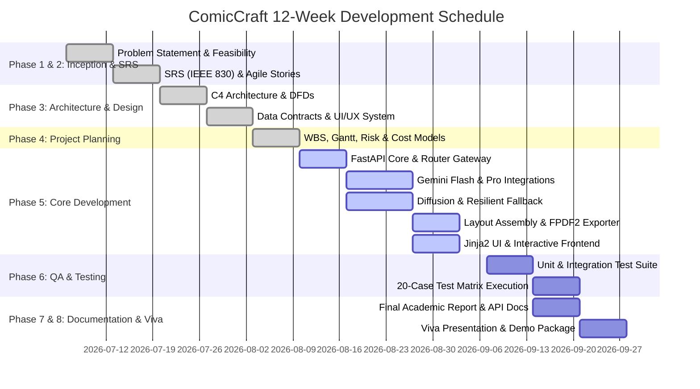

# Phase 4: Project Planning
## Document 02: 12-Week Gantt Schedule & Milestones

---

### 1. 12-Week Implementation Timeline

The project follows a 12-week Agile schedule partitioned into 6 two-week sprints.

---

### 2. Major Project Milestones

| Milestone | Target Week | Deliverable / Success Criteria | Verification Mode |
| :--- | :--- | :--- | :--- |
| **M1: Baseline Approval** | Week 2 | Approved SRS & Project Charter | Peer review signoff |
| **M2: Architecture Lock** | Week 4 | Approved C4 diagrams, DFDs, Pydantic schemas | Architecture review |
| **M3: Narrative Engine Alpha** | Week 7 | Dual-LLM generating coherent 5-panel scripts | CLI integration test |
| **M4: Visual Pipeline Beta** | Week 9 | Diffusion & fallback canvas rendering panels | Isolated image test |
| **M5: Full System Integration**| Week 10| Web UI end-to-end comic generation & PDF download| End-to-end manual pass |
| **M6: QA Verification** | Week 11| 20/20 test cases passing in automated suite | Pytest automated run |
| **M7: Viva Defense Ready** | Week 12| Final academic report, slide deck & live demo | Committee presentation |

---

### 3. Critical Path Analysis (CPM)
1. **Critical Path**: `SRS` $\to$ `C4 Design` $\to$ `FastAPI Core` $\to$ `Gemini Flash/Pro` $\to$ `Diffusion Engine` $\to$ `Layout Builder` $\to$ `FPDF2 Exporter` $\to$ `Integration Testing` $\to$ `Academic Report`.
2. **Slack Activities**: UI Halftone styling, Presets library generation, and Diagnostic `/test-image` route have positive float (slack of 3 to 5 days).

