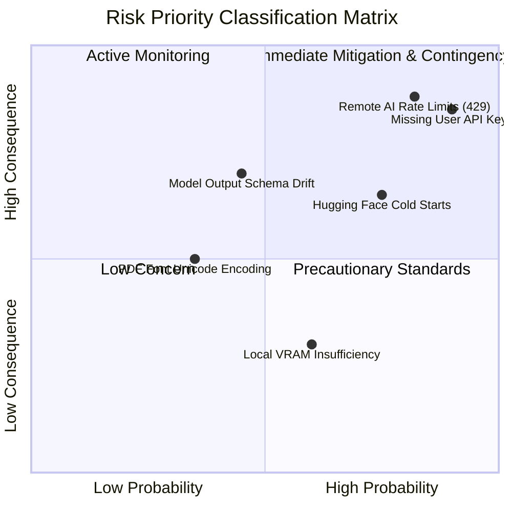

# Phase 4: Project Planning
## Document 03: Risk Management & Mitigation Framework

---

### 1. Risk Matrix (Probability vs. Consequence)

---

### 2. Comprehensive Risk Registry & Mitigation Strategies

| Risk ID | Risk Description | Prob. | Impact | Severity | Mitigation & Contingency Strategy |
| :--- | :--- | :--- | :--- | :--- | :--- |
| **RSK-01** | **Third-party API rate limits (Google AI / Hugging Face 429)** | High | High | Critical | **Mitigation**: Implement exponential backoff retry logic. **Contingency**: Autonomous fallback to deterministic procedural narrative synthesis and styled local fallback panel generation. |
| **RSK-02** | **First-time user runs app without API keys configured** | High | High | Critical | **Mitigation**: Detect missing `.env` keys gracefully. Render helpful banner in UI explaining where to get keys. Run in intelligent offline preview mode instead of crashing. |
| **RSK-03** | **LLM JSON Schema Drift (hallucinated formatting)** | Medium | High | High | **Mitigation**: Enforce strict system instructions and Pydantic validation with regex repair routines on markdown code blocks (`json ... `). |
| **RSK-04** | **HF Inference API latency / cold-starts (>30s)** | High | Med | High | **Mitigation**: Configure 20s timeout per panel with immediate failover to procedural canvas synthesizer. |
| **RSK-05** | **FPDF character encoding errors on special characters** | Low | Med | Medium | **Mitigation**: Clean unicode strings (transliterate curved quotes, em-dashes, and accented characters to standard ASCII/Latin-1 compatible strings) prior to cell insertion. |
| **RSK-06** | **Large panel images exhausting server memory** | Low | Low | Low | **Mitigation**: Pillow automatically normalizes image sizes to 512x512 with 85% JPEG/PNG compression before storage. |

