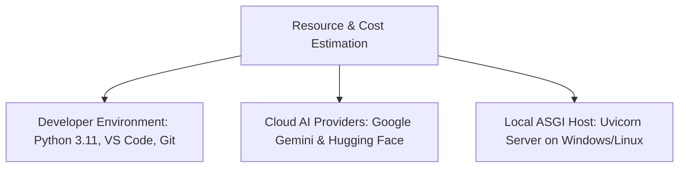

# Phase 4: Project Planning
## Document 04: Resource, Capacity & Budget Estimation

---

### 1. Hardware, Software & Infrastructure Resources

#### Infrastructure Specifications:
- **Local Host Hardware**: Standard dual-core CPU, 4GB+ RAM, 500MB free disk space. No dedicated discrete GPU required.
- **Python Runtime**: Python 3.10 or 3.11 with pip.
- **Network**: Standard broadband connection (1 Mbps+) for remote API calls.

---

### 2. Operational Cost & Budget Analysis

| Cost Item | Resource / Tier | Monthly Quota / Usage | Cost ($ USD) | Cost Justification |
| :--- | :--- | :--- | :--- | :--- |
| **Narrative Generation (Flash)** | Google AI Studio Free Tier | 15 RPM / 1,500 RPD | **\$0.00** | Free tier is sufficient for testing, academic defense, and prototyping. |
| **Script Generation (Pro)** | Google AI Studio Free Tier | 2 RPM / 50 RPD | **\$0.00** | Structured dialogue generation within free limits. |
| **Visual Diffusion Engine** | Hugging Face Free User Token | Community Inference API | **\$0.00** | Standard public model inference (`stable-diffusion-v1-5`). |
| **Procedural Fallback Engine** | Local Pillow Synthesis | Unlimited | **\$0.00** | Zero external network calls or cloud costs. |
| **Hosting & Compute** | Local Workstation | N/A | **\$0.00** | Localhost execution via `run.bat` / `run.ps1`. |
| **Total Operating Cost** | | | **\$0.00** | **100% Free Open-Source Architecture** |

---

### 3. Commercial Scaling Projection (Optional Production Cloud Tier)
If scaled into a high-concurrency public cloud SaaS:
- Google Cloud Run (Containerized FastAPI): ~\$15.00/month
- Google Gemini Pay-As-You-Go API: ~\$0.00035 per 1,000 input tokens / ~\$0.00105 per 1,000 output tokens ($\approx \$0.003$ per 5-panel comic)
- RunPod / Replicate Serverless SDXL GPU endpoint: $\approx \$0.002$ per 512x512 image ($\approx \$0.010$ per comic)
- **Total SaaS Cost per 5-panel comic**: **$\approx \$0.013$ (1.3 cents)**.

