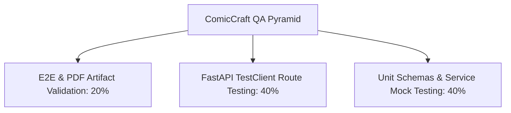

# Phase 6: Project Testing
## Document 01: Test Plan & Quality Assurance Strategy

---

### 1. Test Strategy Overview

The testing strategy for ComicCraft ensures total system dependability across multiple tiers:
- **Unit Testing**: Isolated verification of individual functions, regex filters, Pydantic schemas, and fallback generators.
- **Integration Testing**: End-to-end verification of route handlers, request validation, data serialization, and file I/O operations.
- **Resilience / Fault-Tolerance Testing**: Verification that missing or invalid API keys, rate-limiting (429), or network dropouts trigger graceful fallbacks without crashing the server.
- **Publishing & Artifact Verification**: Verification that generated PNG panel images and FPDF2 vector PDFs conform to strict dimensions, headers, and encoding integrity.

---

### 2. Testing Scope & Environment

| Dimension | Specification |
| :--- | :--- |
| **Test Framework** | `pytest >= 8.1.0` with `httpx` and `starlette.testclient` |
| **Execution Environment** | Python 3.11 virtual environment (`.venv`) |
| **Pass/Fail Threshold** | 100% of test cases must pass (20/20 in matrix) |
| **Execution Command** | `pytest 06_Project_Testing/test_suite/ -v` |

---

### 3. Test Categories
1. **API Contract & Schema Testing**: Validates that malformed JSON or invalid form payloads return clean HTTP 422 / 400 responses.
2. **Dual-LLM Pipeline Testing**: Validates that `gemini_flash.py` generates exactly $N$ panels with proper sequencing and that `gemini_pro.py` attaches dialogue, captions, and onomatopoeia.
3. **Image Synthesis & Failover**: Verifies that `image_generator.py` writes valid 600x600 PNG images to `static/panels/` under both cloud API and local procedural modes.
4. **Desktop Publishing & PDF Export**: Validates that `exporters.py` compiles multi-page A4 PDFs with headers, footers, images, and sanitized latin-1 text.
5. **Static File Streaming**: Validates that `/download-pdf/{filename}` properly streams the file with valid `application/pdf` MIME types.

