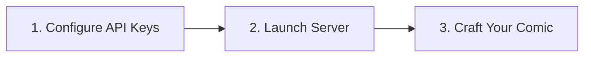

# Phase 7: Project Documentation
## Document 03: End-User Manual & Operation Guide

---

### 1. Introduction & Welcome

Welcome to **ComicCraft**! ComicCraft is an AI-powered visual comic story creator. With zero illustration skills required, you can type in any story premise, select a character and artistic style, and receive an authentic, illustrated comic strip ready to read or download as a printable PDF book.

---

### 2. Getting Started in 3 Easy Steps



#### Step 1: Configure Your API Keys
1. Open `05_Project_Development/.env` in any text editor (Notepad, VS Code).
2. Paste your Google Gemini API Key and Hugging Face Token:
```env
GEMINI_API_KEY=AIzaSy...
HF_API_KEY=hf_...
```
*(Note: If you run ComicCraft without keys, it automatically activates an offline procedural fallback mode so you can still generate comic layouts and PDFs!)*

#### Step 2: Launch ComicCraft
- On Windows: Double-click **`run.bat`** (or open PowerShell and run `.\run.ps1`).
- Open your browser to: **`http://127.0.0.1:8000`**

#### Step 3: Enter Your Story Details
1. **Story Premise**: Describe what happens in your story.
2. **Main Character**: Name your hero (e.g. *Max Blaze*, *Captain Spark*).
3. **Setting / World**: Where the adventure unfolds (e.g. *Neon Tokyo 2099*, *Medieval Castle*).
4. **Tone**: Select the mood (*Superhero*, *Sci-Fi*, *Mystery*, *Humorous*, *Fantasy*).
5. **Visual Art Style**: Choose an aesthetic (*Classic Comic Book*, *Dark Cyberpunk*, *Manga / Anime*, *Vintage Pop Art*).
6. **Panels**: Choose 5 panels for a complete dramatic arc.
7. Click **`GENERATE FULL COMIC STRIP & PDF`**!

---

### 3. Understanding the Comic Preview Screen

Once generated, your comic will be displayed with:
- **Narrative Caption Boxes**: Pale yellow boxes at the top of each panel explaining the setting and backstory.
- **Illustration Canvas**: High-resolution comic artwork synthesized for that specific scene beat.
- **Speech Balloons**: Rounded dialogue bubbles showing character quotes.
- **Sound Effect Badges**: Angled comic action onomatopoeia (e.g. `POW!`, `WHOOSH!`, `KRAK!`).
- **Export to PDF**: Click the top or bottom button to download your comic as a printable vector PDF!

---

### 4. Pro Storytelling & Prompt Crafting Tips
- **Be Action-Oriented**: Write stories with a clear turning point. Instead of *"A boy sits in a room"*, write *"A boy opens a glowing antique chest and a miniature dragon flies out."*
- **Match Tone and Style**: For intense detective stories, choose `Mystery / Noir` tone and `Dark Cyberpunk` or `Graphic Novel` style. For comedic stories, choose `Humorous` tone and `Classic Comic Book` or `Vintage Pop Art`.
- **Use Presets**: If you need inspiration, click one of the quick preset buttons (*"Cyberpunk Hero"*, *"Deep Space Signal"*, *"Victorian Mystery"*, *"Dragon Rider"*) on the homepage.

---

### 5. Frequently Asked Questions (FAQ)

**Q: Where are my generated comics saved?**
A: Images are saved to `05_Project_Development/static/panels/` and PDFs are saved to `05_Project_Development/static/exports/`.

**Q: Can I print the generated PDF?**
A: Yes! The PDF is sized for standard A4 paper. In your printer dialog, select *"Fit to Printable Area"* for crisp, beautiful margins.

**Q: What happens if my internet connection drops or API quota is reached?**
A: ComicCraft's resilient engine automatically detects API timeouts or errors and switches to procedural synthesis, so your comic generation will never crash!

