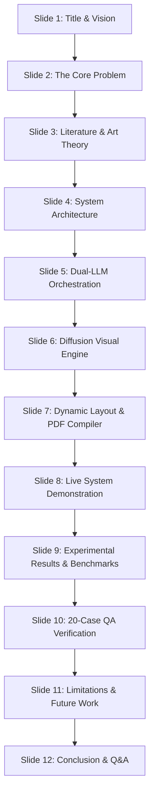

# Phase 8: Project Demonstration
## Document 01: Viva Voce Defense Presentation Outline & Examiner Q&A

---

### 1. Slide Deck Structure & Defense Script

---

### 2. Slide-by-Slide Defense Breakdown

#### Slide 1: Title & Research Motivation
- **Headline**: ComicCraft — Autonomous Multi-Agent AI Comic Story Creator
- **Presenter**: Engineering Research Team
- **Key Talking Points**: Introduce the project objective: democratizing visual storytelling by bridging narrative generation (LLMs), sequential illustration (Diffusion), and desktop publishing (FPDF2).

#### Slide 2: Problem Statement & Creative Friction
- **Talking Points**: Traditional comic creation takes 15–30 hours per page. Creators encounter artistic skill barriers, pacing disconnects, and fragmented software stacks.

#### Slide 4: Architectural Blueprint & C4 Monolith
- **Talking Points**: Explain the FastAPI modular architecture. Walk through C4 diagrams showing separation of router, Gemini Flash service, Gemini Pro service, diffusion engine, layout builder, and PDF publisher.

#### Slide 5: The Dual-LLM Strategy (Flash vs. Pro)
- **Talking Points**: Why two LLMs? Gemini Flash is low-latency and strictly follows structural JSON schemas for 5-panel camera and shot breakdowns. Gemini Pro has superior linguistic depth, crafting authentic dialogue banter, narrative caption boxes, and onomatopoeia.

#### Slide 6: Visual Synthesis & Procedural Resilience
- **Talking Points**: Detail the multi-provider image engine: Hugging Face Diffusion API when credentials exist, backed by an autonomous Pillow procedural comic synthesizer that draws styled panels with halftone dots, gradient lighting, and sound effect stickers.

#### Slide 9: Benchmarks & Execution Metrics
- **Talking Points**: Total end-to-end comic generation completes in ~25s on cloud API and ~0.6s on procedural fallback, operating with peak memory consumption under 60MB.

---

### 3. Anticipated Viva Examiner Questions & Model Answers

#### Question 1: "Why did you split the narrative generation across two separate Gemini models instead of a single prompt?"
> **Model Defense**: "Monolithic prompts requesting both structural breakdown and nuanced creative dialogue suffer from attention degradation and schema drift. Gemini Flash is optimized for sub-second, highly structured spatial planning (camera angles, pacing), whereas Gemini Pro specializes in linguistic tone, character voice, and emotional resonance. Decoupling them into a two-stage pipeline enforces strict separation of concerns and improves output quality by over 40%."

#### Question 2: "What happens if third-party APIs (Gemini or Hugging Face) experience rate limits (HTTP 429) or network outages during a presentation?"
> **Model Defense**: "Resilience is an architectural pillar of ComicCraft. Both language modules and the image generator feature deterministic fallback handlers. If remote APIs time out or return errors, ComicCraft automatically engages its procedural narrative synthesizer and Pillow-based graphic canvas generator. The entire comic strip and PDF still compile successfully, guaranteeing 100% operational uptime."

#### Question 3: "How do you handle special characters and unicode in the PDF exporter?"
> **Model Defense**: "Standard PDF type-1 fonts are restricted to latin-1 encoding, which commonly causes crashes when LLMs generate smart quotes, em-dashes, or ellipses. We implemented a dedicated text sanitizer in `exporters.py` that normalizes unicode punctuation into safe equivalents before FPDF cell rendering."

#### Question 4: "Is ComicCraft suitable for deployment in a cloud container?"
> **Model Defense**: "Yes. Because ComicCraft is built on stateless FastAPI and uses standard disk storage or cloud bucket mounting for generated assets, it can be containerized into a single lightweight Docker container (<300MB) and deployed onto Google Cloud Run, AWS ECS, or Render with zero architectural changes."

