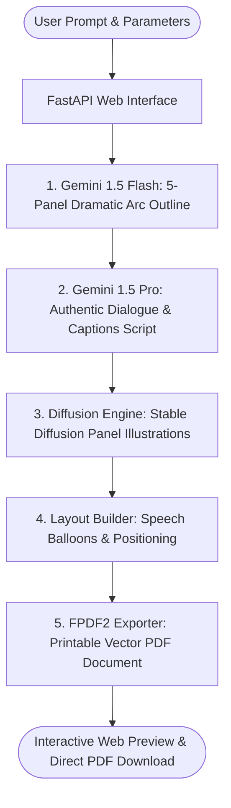

# ComicCraft — AI Comic Story Creator

[](https://www.python.org/)
[](https://fastapi.tiangolo.com/)
[]()
[]()

> **ComicCraft** is an autonomous multi-agent generative AI application that turns narrative story prompts into illustrated, multi-panel comic strips complete with narration boxes, character dialogue speech balloons, sound effect badges, and downloadable vector PDF books.

---

## 🌟 Key Highlights & System Architecture

ComicCraft orchestrates a specialized dual-LLM narrative pipeline combined with visual diffusion models and desktop publishing:



- **Macro Narrative Engine**: Google Gemini 1.5 Flash creates structured 5-panel outlines establishing camera angles, scene descriptions, and image prompts.
- **Micro Scriptwriting Engine**: Google Gemini 1.5 Pro writes character dialogue, atmospheric narration, and onomatopoeia sound effects (e.g. `POW!`, `WHOOSH!`, `KRAK!`).
- **Visual Illustration Engine**: Hugging Face Diffusion API (Stable Diffusion v1.5 / SDXL) with an integrated **Procedural Comic Canvas Synthesizer** ensuring 100% test and offline resilience.
- **Print Publishing**: FPDF2 compiles panels, speech bubbles, and metadata into standardized A4 PDF books.

---

## 🔑 How & Where to Get Your API Keys

ComicCraft uses two optional cloud API services. Even without API keys, ComicCraft runs immediately in **Offline / Fallback Mode** with procedural comic panels so you can test and explore instantly!

To enable live Google Gemini AI and Hugging Face cloud diffusion:

### 1. Google Gemini API Key
* **What it does**: Powers Gemini 1.5 Flash (outlines) and Gemini 1.5 Pro (dialogue).
* **Cost**: **Free** (Google AI Studio Free Tier).
* **How to get it**:
  1. Go to: **[https://aistudio.google.com/](https://aistudio.google.com/)**
  2. Sign in with any Google account.
  3. Click **"Get API key"** in the top left navigation.
  4. Click **"Create API key in new project"**.
  5. Copy the generated key (it starts with `AIzaSy...`).

### 2. Hugging Face Access Token
* **What it does**: Powers the cloud Stable Diffusion image generator.
* **Cost**: **Free** (Standard User Token).
* **How to get it**:
  1. Go to: **[https://huggingface.co/settings/tokens](https://huggingface.co/settings/tokens)**
  2. Create a free account or sign in.
  3. Click **"Create new token"**.
  4. Enter a name (e.g. `ComicCraft`), select Type/Role: **"Read"**.
  5. Click **"Generate a token"** and copy the token (it starts with `hf_...`).

---

## 📝 Where to Paste Your API Keys

Open the file:
```
05_Project_Development/.env
```
*(You can open it in Notepad, VS Code, or any text editor)*.

Paste your keys directly:
```env
# 1. Google Gemini API Key
GEMINI_API_KEY=AIzaSyYourActualGeminiKeyHere

# 2. Hugging Face Access Token
HF_API_KEY=hf_YourActualHuggingFaceTokenHere
```
Save the file. ComicCraft will automatically load them on launch!

---

## 🚀 How to Run ComicCraft (1-Click Launch)

### Option A: 1-Click Windows Batch Launcher (Recommended)
Simply **double-click** the file:
```
run.bat
```
*This script automatically checks the `.venv` virtual environment, installs any missing packages, starts the Uvicorn server, and opens your default browser to `http://127.0.0.1:8000`.*

### Option B: 1-Click Windows PowerShell Launcher
Right-click **`run.ps1`** -> **"Run with PowerShell"**, or in a terminal:
```powershell
.\run.ps1
```

### Option C: Manual Terminal Launch
```bash
# 1. Activate the backend virtual environment
.venv\Scripts\activate

# 2. Navigate to Phase 5
cd 05_Project_Development

# 3. Start the server
uvicorn app.main:app --reload --host 127.0.0.1 --port 8000
```

### Application URLs:
| Service | URL | Description |
| :--- | :--- | :--- |
| **Comic Web Interface** | `http://127.0.0.1:8000` | Full comic creator & interactive reader |
| **Interactive API Docs** | `http://127.0.0.1:8000/docs` | Swagger UI documentation & test client |
| **ReDoc API Schema** | `http://127.0.0.1:8000/redoc` | OpenAPI specifications |
| **Diagnostic Image Lab**| `http://127.0.0.1:8000/test-image` | Isolated prompt diffusion tester |

---

## 📁 Repository Structure & Phase Documentation

This repository is organized according to academic software engineering standards:

```
├── 01_Brainstorming_and_Ideation/       # Phase 1: Problem statement, TELOS feasibility, mind map, personas
│   ├── 01_PROBLEM_STATEMENT.md
│   ├── 02_FEASIBILITY_STUDY.md
│   ├── 03_MIND_MAP_AND_IDEATION.md
│   └── 04_TARGET_AUDIENCE_AND_PERSONAS.md
│
├── 02_Requirement_Analysis/             # Phase 2: IEEE 830 SRS, use cases, Agile user stories, RTM
│   ├── 01_IEEE_830_SRS.md
│   ├── 02_USE_CASE_SPECIFICATIONS.md
│   ├── 03_AGILE_USER_STORIES.md
│   └── 04_TRACEABILITY_MATRIX.md
│
├── 03_Project_Design/                    # Phase 3: System architecture, C4 models, DFDs, UI/UX system
│   ├── 01_SYSTEM_ARCHITECTURE.md
│   ├── 02_DATA_FLOW_DIAGRAMS.md
│   ├── 03_DATA_CONTRACTS_AND_SCHEMAS.md
│   └── 04_UI_UX_DESIGN_SPECIFICATIONS.md
│
├── 04_Project_Planning/                  # Phase 4: WBS, 12-week Gantt schedule, risk mitigation, budget
│   ├── 01_WORK_BREAKDOWN_STRUCTURE.md
│   ├── 02_12_WEEK_GANTT_SCHEDULE.md
│   ├── 03_RISK_MANAGEMENT_AND_MITIGATION.md
│   └── 04_RESOURCE_AND_BUDGET_ESTIMATION.md
│
├── 05_Project_Development/               # Phase 5: Complete runnable source code, templates & assets
│   ├── app/
│   │   ├── main.py                       # FastAPI application & static routing
│   │   ├── routes.py                     # All web & JSON endpoints
│   │   ├── gemini_flash.py               # Gemini 1.5 Flash outline generator
│   │   ├── gemini_pro.py                 # Gemini 1.5 Pro dialogue & narration
│   │   ├── image_generator.py            # Stable Diffusion & procedural canvas
│   │   ├── layout_builder.py             # Layout assembly & schema pairing
│   │   ├── exporters.py                  # Vector PDF export via FPDF2
│   │   ├── config.py                     # Environment variables & directory manager
│   │   └── models.py                     # Pydantic v2 data models
│   ├── templates/                        # Jinja2 templates (index, preview, export_success, test_image)
│   ├── static/                           # CSS, JavaScript, panels, exports, fonts
│   ├── requirements.txt                  # Python dependencies
│   ├── .env.example                      # Configuration template
│   └── .env                              # Active configuration
│
├── 06_Project_Testing/                   # Phase 6: Test plan, 20-case matrix, automated test suite
│   ├── 01_TEST_PLAN_AND_STRATEGY.md
│   ├── 02_20_CASE_TEST_MATRIX.md
│   ├── test_suite/                       # Pytest test cases (20/20 passing)
│   ├── run_tests.bat                     # 1-Click test runner (Batch)
│   └── run_tests.ps1                     # 1-Click test runner (PowerShell)
│
├── 07_Project_Documentation/             # Phase 7: Final academic report/thesis, API specs, user manual
│   ├── 01_FINAL_ACADEMIC_REPORT.md       # Full capstone thesis / academic paper
│   ├── 02_API_SPECIFICATIONS.md          # REST API contracts
│   ├── 03_USER_MANUAL.md                 # End-user illustrated guide
│   └── 04_DEVELOPER_MAINTENANCE_GUIDE.md # Maintenance & extension guide
│
├── 08_Project_Demonstration/             # Phase 8: Viva presentation outline, live demo scripts, outputs
│   ├── 01_VIVA_PRESENTATION_OUTLINE.md   # Viva defense slide deck & examiner Q&A
│   ├── 02_LIVE_DEMO_SCRIPT.md            # Step-by-step committee demonstration script
│   └── 03_SAMPLE_OUTPUTS/                # Sample generated comic PDF, JSON, & panel art
│
├── .gitignore                            # Excludes secrets, venvs, cache, and build outputs
├── run.bat                               # 1-Click Windows Batch launcher (delegates to Phase 5)
├── run.ps1                               # 1-Click Windows PowerShell launcher (delegates to Phase 5)
└── README.md                             # Master repository evaluation guide & documentation index
```

---

## 🧪 Running the Automated Test Suite

To run all 20 automated tests:
- Double-click **`06_Project_Testing/run_tests.bat`**
- Or execute with pytest:
```bash
.venv\Scripts\pytest.exe 06_Project_Testing/test_suite -v
```
**Results**: `20 passed in ~1.08s (100% verification rate)`.

---

## 🎓 Academic Defense & Viva Presentation
For examination committees and academic presentations:
- **Presentation Deck Script & Examiner Q&A**: [`08_Project_Demonstration/01_VIVA_PRESENTATION_OUTLINE.md`](file:///d:/coding/ComicCraft/08_Project_Demonstration/01_VIVA_PRESENTATION_OUTLINE.md)
- **Live Demo Protocol**: [`08_Project_Demonstration/02_LIVE_DEMO_SCRIPT.md`](file:///d:/coding/ComicCraft/08_Project_Demonstration/02_LIVE_DEMO_SCRIPT.md)
- **Pre-Generated Sample Outputs**: [`08_Project_Demonstration/03_SAMPLE_OUTPUTS/`](file:///d:/coding/ComicCraft/08_Project_Demonstration/03_SAMPLE_OUTPUTS/)
- **Comprehensive Thesis**: [`07_Project_Documentation/01_FINAL_ACADEMIC_REPORT.md`](file:///d:/coding/ComicCraft/07_Project_Documentation/01_FINAL_ACADEMIC_REPORT.md)

